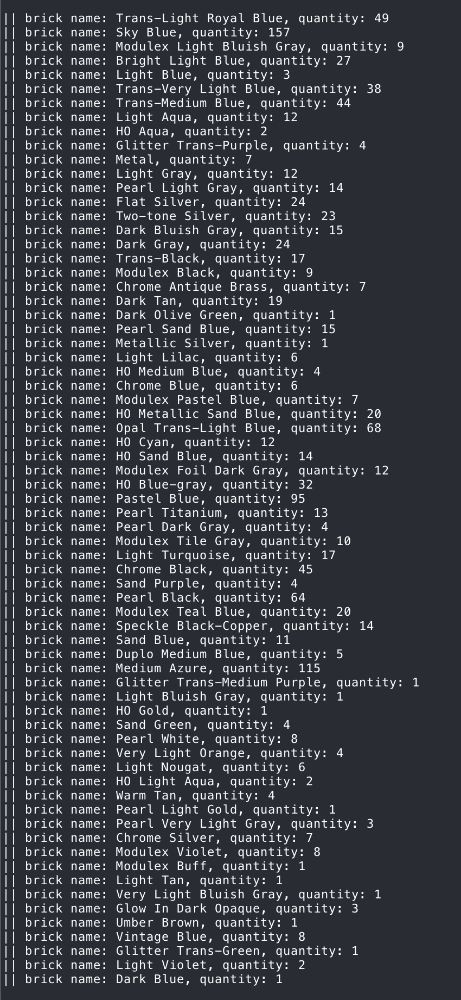

# PPM Blur and LEGO Mosaic Generator

This project processes `.ppm` images (binary PPM, P6 format) and pixelates them into block-like regions.  
Each region is matched with the closest LEGO brick color available from a reference dataset, producing both:

1. A blurred/mosaic version of the input image.  
2. A bill of materials listing the number and type of LEGO bricks required to recreate the image physically.  

---

## Project Structure

- **ppm_blur.c**  
  Main program. Handles image processing, block averaging, pixelation, and integration with the LEGO brick dataset.

- **data.c / data.h**  
  Implements a simple "LEGO list" API. Loads the CSV dataset into memory and provides helper functions to:
  - Retrieve total number of bricks.
  - Map a brick ID to its name.
  - Find the best matching brick for a given RGB value.

- **list.csv**  
  Dataset of LEGO bricks (#3024 tile variants). Each row contains:
  - ID
  - Brick name
  - RGB color values

- **Makefile**  
  Provides build instructions for the project.

---

## Compilation

```bash
make
```
This will produce an executable named ppm_blur.

## Usage

```bash
./ppm_blur <block_size> <image.ppm>
```

- <block_size>: Desired pixelation block size (integer > 0) usully between 20 and 100 is fine.

- <image.ppm>: Path to the input PPM (P6) image file.

The program will:

- Pixelate the image in-place (the input file is modified).

- Print to the console a list of required LEGO bricks with their quantities.

## Example

```bash
./ppm_blur 40 img.ppm
```


**That's me! :)**



and this is the list of bricks 
